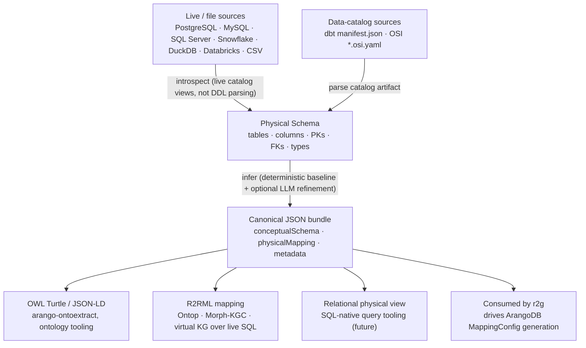

# relational-schema-analyzer

Analyze a **relational database schema** and produce a canonical **conceptual model**
(entities / relationships / properties), a **conceptual → physical mapping** back to the
source relational schema, and **metadata** (confidence, fingerprints, patterns). Optional
exports include **OWL** (Turtle / JSON-LD) for ontology pipelines and **R2RML** for
virtual knowledge graphs.

This library is the relational analogue of
[`arangodb-schema-analyzer`](https://pypi.org/project/arangodb-schema-analyzer/) and
emits the **same tool-contract bundle shape** so that downstream consumers
(`arango-ontoextract`, transpilers, and ETL tools such as `r2g`) can treat relational and
ArangoDB sources interchangeably.



## Status

Active development — **v0.8.0 on [PyPI](https://pypi.org/project/relational-schema-analyzer/)**
(`pip install relational-schema-analyzer`). All core phases (0–5) are implemented: the
physical core (connectors, types, FK inference) extracted from `r2g`; a deterministic
conceptual baseline that emits a contract-valid `{conceptualSchema, physicalMapping, metadata}`
bundle with no LLM; OWL (Turtle / JSON-LD) and R2RML exports and a CLI; class-abstraction
discovery (type discriminators + taxonomy) via the shared `conceptual-taxonomy`
library; optional, additive LLM refinement; and the v1 tool-contract entrypoint +
MCP server. Two data-catalog sources
(`dbt`, `osi`) ship alongside the seven live/file sources. Remaining work is the live Docker
introspection corpus and the downstream `r2g` / `arango-ontoextract` integration PRs.

**Production boundary.** RSA is the production-grade core for relational schema
analysis in ArangoDB Solutions: downstream systems — the
[`r2g`](https://github.com/ArthurKeen/r2g-arango) reference application and the
contextual-data-fabric building blocks — depend on RSA's **versioned PyPI
releases** and its stable `{conceptualSchema, physicalMapping, metadata}` **tool
contract**, not on r2g internals. RSA is pre-1.0 and under active development,
so consumers should **pin a version**; the tool-contract bundle shape is the
stability surface.

## Keys, catalogs, and enterprise scale

Three questions every serious deployment asks, answered at the library level:

**"Our warehouse doesn't define primary/foreign keys — do you infer them?"**
Yes, in two layers. Cloud warehouses (Snowflake among them) accept PK/FK/UNIQUE
*declarations* without enforcing them — and many schemas declare nothing at
all. RSA reads **declared** constraints from the source catalog wherever they
exist (on Snowflake via `SHOW PRIMARY KEYS` and the declared FK/unique views —
documentation-grade metadata even when unenforced). Where nothing is declared,
`infer_foreign_keys` proposes candidates by **name-convention heuristics**
(`account_id` ↔ `accounts`) and confirms them with **bounded value-overlap
sampling** — the fraction of a child column's distinct values present in the
candidate parent, computed on samples, never bulk reads. Inferred keys carry a
confidence score so downstream review can accept or reject them. Sampler
coverage is per-connector (PostgreSQL, MySQL, SQL Server, DuckDB, CSV today; the
Snowflake value sampler is tracked work — until then Snowflake inference is
declared-keys + name heuristics).

**"Do you use the source's own catalog?"** Yes — introspection *is* catalog
reading: `INFORMATION_SCHEMA`/`SHOW` surfaces for tables, columns, types, and
declared constraints, plus dbt manifests and OSI documents as first-class
catalog sources. The principle: **never ask anyone to re-describe what their
catalog already knows.** Planned extensions read the richer surfaces — object
comments, governance tags, and access/query history — as inputs to relevance
scoping (below).

**"We have thousands of tables — how do you decide which ones matter?"**
By the integration's declared **purpose**, not by introspecting everything. A
purpose statement plus competency questions (e.g. "a Customer 360 view") ranks
tables by relevance before extraction: purpose-term similarity against
table/column names and comments, FK-neighborhood expansion from seed tables,
the warehouse's own **access/query history** (the tables an organization
actually queries are the relevant ones), and governance tags as
include/exclude policy — with a human confirming the ranked candidate set
rather than hand-listing tables. This is tracked as the purpose-scoped
relevance stage of the consuming fabric's extraction pipeline.

See:

- [`docs/DESIGN.md`](docs/DESIGN.md) — architecture, data model, tool contract, OWL mapping
- [`docs/IMPLEMENTATION-PLAN.md`](docs/IMPLEMENTATION-PLAN.md) — phased delivery plan & extraction inventory
- [`docs/DESIGN-ADDENDUM-taxonomy.md`](docs/DESIGN-ADDENDUM-taxonomy.md) — class-abstraction discovery
- [`docs/DESIGN-ADDENDUM-bitemporal.md`](docs/DESIGN-ADDENDUM-bitemporal.md) — bitemporal stamping of physical schemas

**Class abstractions (0.6.0).** Beyond the baseline's shared-PK `subClassOf`
inference, RSA discovers type-discriminator columns and hands the assembled
inputs to [`conceptual-taxonomy`](https://pypi.org/project/conceptual-taxonomy/) —
the same library the ArangoDB analyzer uses, so both paradigms yield the same
taxonomy. Discriminators come from declared `CHECK (col IN (…))` constraints
(exact, no database access) or, opt-in behind an injected enumerator, from
bounded sampling of name-affine columns. Relationally, class-table inheritance
is *declared* rather than measured — a child table whose primary key is also a
foreign key to its parent says so in the constraint — so containment needs no
probe budget. The library's edges arrive as `subClassOfProposals` carrying
mechanism, confidence, and evidence alongside the baseline's scalar
`subClassOf`, so consumers arbitrate instead of being handed a verdict. Both
OWL serializations emit every discovered parent. Needs the extra:
`pip install 'relational-schema-analyzer[taxonomy]'`.

```python
from relational_schema_analyzer import (
    create_connector, RelationalSchemaAnalyzer, export_owl_turtle,
)

physical = create_connector("postgresql", url, schema_name="public").get_schema()
analysis = RelationalSchemaAnalyzer().analyze(physical)   # baseline, no LLM
bundle = analysis.to_bundle()    # {conceptualSchema, physicalMapping, metadata}
ttl = export_owl_turtle(analysis)

# Optional LLM refinement (additive; falls back to baseline on any error):
refined = RelationalSchemaAnalyzer(
    llm_provider="openai",           # or "anthropic" / "openrouter" / a provider object
).analyze(physical)                  # better names + embed/n-ary hints
```

```bash
relational-schema-analyzer snapshot --source postgresql --url "$DSN" -o physical.json
relational-schema-analyzer analyze  --from-snapshot physical.json --pretty
relational-schema-analyzer owl      --from-snapshot physical.json --format turtle -o schema.ttl
relational-schema-analyzer r2rml    --from-snapshot physical.json -o mapping.ttl
```

**R2RML export.** `owl` emits the ontology (what the concepts *are*); `r2rml` emits a
[W3C R2RML](https://www.w3.org/TR/r2rml/) mapping (how to reach them in SQL). The class
and property IRIs are identical in both, so feeding the pair to an R2RML processor
(Ontop, Morph-KGC, db2triples) gives you a virtual knowledge graph over the live
database with no hand-written mapping:

```bash
relational-schema-analyzer owl   --source postgresql --url "$DSN" -o ontology.ttl
relational-schema-analyzer r2rml --source postgresql --url "$DSN" -o mapping.ttl
```

Each entity becomes an `rr:TriplesMap` over a schema-qualified `rr:logicalTable`, with an
IRI `rr:template` built from the primary key (tables without one fall back to blank-node
subjects and are flagged). Foreign keys become referencing object maps with a full
`rr:joinCondition`, and N:M join tables get their own TriplesMap. R2RML cannot attach
properties to a relationship, so a join table's non-key attribute columns are reported in
a comment rather than silently dropped — reify the association if you need them.

Sources: `postgresql`, `mysql`, `sqlserver`, `snowflake`, `duckdb`, `databricks`, `csv`,
plus two **data-catalog** sources (see `docs/DESIGN.md` §9.3.1): `dbt` (a dbt
`manifest.json` — tests/contracts → constraints + FKs) and `osi` (an Open Semantic
Interchange `*.osi.yaml` model — datasets/fields/primary_key/unique_keys → tables +
constraints, `relationships` → FKs; OSI carries no column types, so types degrade to
`temporal` for `is_time` fields and `string` otherwise). The `osi` source needs
PyYAML: `pip install 'relational-schema-analyzer[osi]'`.

**Declared-key overlay.** Some sources describe their tables faithfully and their *keys* not
at all — BigQuery's public datasets declare no primary or foreign keys, and AWS Glue, Hive
Metastore and Iceberg have no constraint vocabulary to declare them with. That is fatal
downstream, because FK inference anchors its candidate targets on declared primary keys: no
PKs means no relationships, and a conceptual schema of isolated entities. An overlay is where
the human who knows the keys writes them down:

```bash
relational-schema-analyzer analyze --source bigquery --url "$DSN" --overlay keys.overlay.json
```

```json
{
  "version": 1,
  "tables": {
    "events": { "primaryKey": ["GLOBALEVENTID"] },
    "eventmentions": {
      "foreignKeys": [
        { "columns": ["GLOBALEVENTID"],
          "references": { "table": "events", "columns": ["GLOBALEVENTID"] },
          "comment": "GDELT codebook: mentions reference their event" }
      ]
    }
  }
}
```

Three rules make it an artifact rather than a hack. **The catalog always wins** — an overlay
fills gaps and never overrides a constraint the source declared. **Overlay keys are labelled,
not laundered** — every FK carries `enforced=False` and an `overlay:`-prefixed constraint name,
and the bundle reports an `overlay_declared_keys` pattern, so a consumer can always tell
catalog-declared from human-declared from inferred. **A typo fails loudly** — unknown tables,
unknown columns and misspelled keys are errors, because an overlay that silently does nothing
is worse than none at all. `--overlay` works on every subcommand, with a live source or
`--from-snapshot`; YAML overlays need PyYAML.

**Consumer metadata passthrough (0.2.0).** `Column` and `Table` carry an optional
`extra: dict` that the analyzer never reads or interprets — it only guarantees the
data survives serialization round-trips. This lets a consumer (e.g. `r2g`'s Phase-9
governance `classification`) adopt these types without losing its own per-column /
per-table metadata. `extra` is omitted from serialization when empty, so schema
dumps and `physicalSchemaFingerprint` values are byte-identical for schemas that
don't use it.

**MCP server** (optional, `pip install 'relational-schema-analyzer[mcp]'`) exposes the same
`snapshot` / `analyze` / `owl` / `r2rml` operations over the v1 tool contract:

```bash
relational-schema-analyzer-mcp                                   # stdio (local IDE)
relational-schema-analyzer-mcp --transport sse --host 0.0.0.0 --port 8000   # remote (set RSA_MCP_TOKEN)
```

## Why this exists

Most of the relational **introspection** layer already exists and is battle-tested inside
the `r2g` (relational-to-graph) project, but it is welded to ArangoDB ETL and cannot be
reused elsewhere. This repo extracts that core into a paradigm-neutral library and adds the
**conceptual / OWL layer** that `r2g` never had, conforming to the contract the ArangoDB
analyzer already publishes.

## License

Apache-2.0 — matching the surrounding Arango ecosystem libraries
(`arangodb-schema-analyzer`, `r2g`). See [`LICENSE`](LICENSE).
