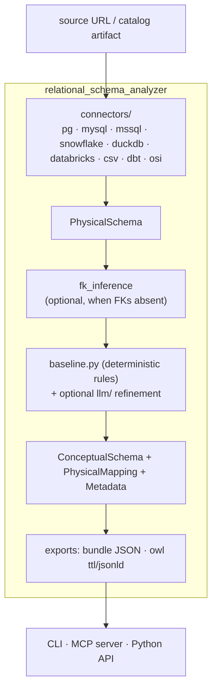

# Design Spec — relational-schema-analyzer

Status: Draft v0.1
Audience: maintainers of `r2g`, `arango-ontoextract`, `arango-schema-mapper`, and future
relational-native query tooling.

---

## 1. Purpose & scope

`relational-schema-analyzer` introspects a relational database and produces:

1. A **physical schema** — a faithful, paradigm-neutral model of the source database
   (tables, columns, primary keys, foreign keys, types, constraints).
2. A **conceptual schema** — entities, relationships, and properties (≈ OWL classes,
   object properties, datatype properties) inferred from the physical schema.
3. A **physical mapping** — the conceptual → relational back-reference, recording exactly
   which table/column/FK each conceptual element came from.
4. **Metadata** — confidence, fingerprints, detected patterns, provenance, review flags.
5. Optional **exports** — OWL Turtle / JSON-LD, plus target-specific views.

### Explicit non-goals

- It does **not** load data, transform rows, or write to any target. (That stays in `r2g`.)
- It does **not** generate an ArangoDB physical mapping (collections/edges). The ArangoDB
  physical layout is the job of `arango-schema-analyzer` (post-load) or `r2g`'s
  `MappingConfig`. This library's `physicalMapping` is **relational**.
- It does **not** parse DDL files. Introspection is via live catalog views (matching the
  current `r2g` connector behavior). A DDL-parsing connector may be added later.

### The architectural fact that shapes the contract

The ArangoDB analyzer's `physicalMapping` is queryable by `arango-cypher` / `arango-sparql`
because those tools query ArangoDB. A **relational** physical mapping is **not** directly
consumable by the AQL transpilers — relational data only becomes Arango-queryable *after*
`r2g` loads it, at which point the Arango physical mapping comes from `r2g`/the Arango
analyzer. Therefore the immediate consumers of this library are:

| Consumer | Consumes | Contract |
| --- | --- | --- |
| `arango-ontoextract` (AOE) | the **rich physical schema model** + provenance | `PhysicalSchema` JSON (AOE owns SQL→OWL/SHACL) |
| `r2g` | conceptual schema + relational physical mapping | JSON bundle (in-process import) |
| Future SQL-native transpilers | conceptual schema + relational physical mapping | JSON bundle |
| Tooling / docs | OWL Turtle / JSON-LD, Markdown | optional exports |

> **Boundary correction (AOE feedback, 2026-06).** AOE asked this library to be a
> **mapping-agnostic, read-only introspector**: it consumes the **rich `PhysicalSchema`
> model** (tables/views, columns with raw SQL type + nullability + default + comment +
> ordinal, PKs, FKs **with a unique/cardinality hint**, unique constraints, CHECK
> constraints, indexes, provenance, normalized type category) and does the SQL→OWL/SHACL
> mapping **itself** — exactly as its `_direct_extract_schema` owns the ArangoDB→OWL mapping.
> So AOE does **not** consume our OWL. We keep the conceptual model + OWL exports as
> **optional** outputs for the *other* consumers (`r2g`, future transpilers, standalone
> ontology tooling); the **physical model is the first-class deliverable** for AOE.

The shared contract for the conceptual consumers is still the JSON bundle
`{ conceptualSchema, physicalMapping, metadata }`, aligned 1:1 with
`arango-schema-mapper/docs/tool-contract/v1/`, with a relational `physicalMapping` variant.

### Goals & success criteria

**Goals**

- **G1 — Reusable physical core.** Provide a paradigm-neutral relational introspection layer
  (currently trapped in `r2g`) that `r2g` and future tools depend on rather than re-implement.
- **G2 — Deterministic conceptual model.** Produce a complete, useful conceptual schema +
  relational physical mapping with **no LLM**; LLM is additive refinement only.
- **G3 — Contract interchangeability.** Emit the same tool-contract bundle shape as
  `arango-schema-analyzer` so one downstream consumer handles relational and Arango sources.
- **G4 — Rich physical model for AOE.** Emit a typed, serializable `PhysicalSchema` carrying
  everything AOE needs to do its own SQL→OWL/SHACL mapping (constraints, indexes, comments,
  defaults, FK cardinality hint, provenance, normalized type category). OWL Turtle / JSON-LD
  remain **optional** exports for standalone / non-AOE consumers.

**Success criteria** (consumer-level, testable)

| ID | Criterion | Verified by |
| --- | --- | --- |
| S1 | `create_connector(type, url).get_schema()` returns a faithful `PhysicalSchema` for PG / MySQL / SQL Server / Snowflake / CSV | ported connector tests against r2g's `docker/` fixtures |
| S2 | `analyze()` emits a bundle that validates against `docs/tool-contract/v1/response.schema.json` with `llm_provider=None` | schema validation in CI on Pagila / Chinook / Northwind |
| S3 | Ambiguous constructs (inferred FKs, shared-PK inheritance, >2-FK join tables) set `reviewRequired=true` rather than guessing silently | golden-bundle assertions |
| S4 | `arango-ontoextract` consumes our `PhysicalSchema` (constraints, indexes, comments, FK unique hint, provenance, type category) and does its own SQL→OWL/SHACL mapping with **no re-querying** | AOE integration (Phase 5); physical-model completeness tests now |
| S5 | `r2g` builds and its existing test suite passes after replacing embedded modules with imports from this library | r2g CI on the integration PR |
| S6 | (Optional OWL path) `phys:*` annotations resolve back to the exact source table/column/FK they came from | round-trip assertion in OWL export tests |

---

## 2. High-level architecture



Mirrors the ArangoDB analyzer's split:

- `snapshot` (physical) → `analyze` (conceptual) → `export` (bundle / OWL / views)
- **deterministic baseline** always works with no LLM and sets `reviewRequired` flags;
  LLM is *additive refinement*, never required.

A key difference / advantage: **relational → conceptual is mostly deterministic** because
the source schema is explicit. The LLM's job is refinement (embed-vs-link hints, n-ary
recognition, naming, denormalization detection), not structural recovery.

---

## 3. Data model

### 3.1 Physical schema (extracted from `r2g`, enriched for the AOE contract)

The core (`Schema`/`Table`/`Column`/`ForeignKey`) was lifted verbatim from
`r2g/src/r2g/types.py` so the extraction stayed mechanical and r2g can re-import it. It
was then **enriched additively** (all new fields default, so r2g re-import is unaffected)
to carry everything AOE needs for its own SQL→OWL/SHACL mapping:

```text
PhysicalSchema
  tables: dict[str, Table]
  source: SourceProvenance | None        # dialect, server_version, database, namespace

Table
  name: str
  columns: list[Column]
  primary_key: list[str]                 # composite-safe
  foreign_keys: list[ForeignKey]
  is_partitioned / partition_of          # PG partition metadata (from r2g)
  schema_name: str | None                # namespace
  comment: str | None
  is_view: bool
  unique_constraints: list[list[str]]    # single + composite
  check_constraints: list[CheckConstraint]
  indexes: list[Index]

Column
  name / data_type (raw SQL type) / is_nullable / is_primary_key
  is_unique / default / comment / ordinal
  type_category  (computed: integer|decimal|boolean|string|temporal|binary|uuid|json|array)

ForeignKey
  columns / foreign_table / foreign_columns / constraint_name
  is_unique                              # cardinality hint: FK unique → 1:1 vs many:1

CheckConstraint   name? / expression / columns / enum_values?   # col IN (...) recognized
Index             name / columns / is_unique / is_primary
SourceProvenance  dialect / server_version / database / namespace
```

The **model** lands first (fully testable, exercised end-to-end by the CSV connector). The
per-dialect catalog introspection that *populates* unique/check/index/comment/default
fields for Postgres/MySQL/SQL Server/Snowflake is the next increment, validated by the
Phase 5 Docker integration suite (we can't faithfully test live-catalog SQL offline).

### 3.2 Conceptual schema (new; mirrors `schema_analyzer/conceptual.py`)

```text
ConceptualSchema
  entities: list[Entity]
  relationships: list[Relationship]
  properties: list[Property]     # usually empty; properties live under entities

Entity
  name: str                      # OWL class local name
  labels: list[str]
  properties: list[PropertyDef]  # {name, type, indexed, unique, nullable}
  source: { kind: "baseline" | "llm" | "human" }

Relationship
  type: str                      # OWL object property local name
  fromEntity / toEntity
  properties: list[PropertyDef]  # association attributes (from join-table columns)
  inverseOf: str | None
  cardinality: "1:1" | "1:N" | "N:M"
  source: { kind: ... }
```

### 3.3 Physical mapping (new; relational variant of `schema_analyzer/mapping.py`)

The back-reference from each conceptual element to the relational source. Uses an explicit
**style enum** mirroring the Arango analyzer's pattern, but with relational semantics:

```text
PhysicalMapping
  entities: { <EntityName>: EntityPhysical }
  relationships: { <RelType>: RelationshipPhysical }

EntityPhysical
  style: "TABLE"                 # one entity per table (baseline)
  schema: str | None
  tableName: str
  properties: [ { conceptualName, columnName, sqlType, nullable, unique } ]
  primaryKey: list[str]

RelationshipPhysical
  style: "FOREIGN_KEY" | "JOIN_TABLE"
  # FOREIGN_KEY: relationship realized by an FK on one entity's table
  fromTable / fromColumns / toTable / toColumns
  # JOIN_TABLE (N:M): relationship realized by an associative table
  joinTable / joinFromColumns / joinToColumns / attributeColumns
```

### 3.4 Metadata (mirrors Arango analyzer)

```text
Metadata
  confidence: float
  reviewRequired: bool
  timestamp / generator / version
  physicalSchemaFingerprint: str   # for drift detection (reuse r2g schema_diff)
  patterns: [ "join_table", "inheritance_via_shared_pk", "soft_delete", ... ]
  provenance: { ... }
  # proposed, additive — see DESIGN-ADDENDUM-bitemporal.md:
  transactionTime / validTime.from / validTimeSource / predecessorFingerprint
```

---

## 4. Conceptual inference rules (deterministic baseline)

Because relational schemas are explicit, the baseline produces a high-quality conceptual
model with no LLM. Rules:

| Relational construct | Conceptual result |
| --- | --- |
| Table (non-join) | `Entity` / `owl:Class` |
| Column | datatype `PropertyDef` (SQL type → XSD/JSON type via shared type map) |
| Primary key | entity identity; functional property hint |
| `UNIQUE` column | `owl:InverseFunctionalProperty` hint |
| Foreign key (N:1) | `Relationship`, `style=FOREIGN_KEY`, `cardinality=1:N` |
| FK column also `UNIQUE` | `cardinality=1:1` |
| Associative / join table (2 FKs, PK = those FKs) | `Relationship`, `style=JOIN_TABLE`, `cardinality=N:M`; extra columns → relationship properties |
| Shared-PK-is-also-FK (table whose PK is an FK to parent) | candidate `rdfs:subClassOf` (inheritance) — flag for review |
| Missing declared FKs | run `fk_inference` (name + value-overlap heuristics) → relationships marked lower confidence |

Join-table detection reuses r2g's existing `_is_likely_join_table()` heuristic.

### LLM refinement (optional, additive)

Mirrors the Arango analyzer's generate/validate/repair loop. Refines, never replaces:

- embed-vs-link recommendations (for downstream graph mapping)
- n-ary relationship recognition (associative tables with >2 FKs)
- semantic naming (pluralization, FK column → relationship name)
- denormalization detection (planned in r2g `PLAN-denormalization-analysis.md`)

Providers behind an interface (`openai` / `anthropic` / `openrouter` extras), same as
`arango-schema-mapper/schema_analyzer/providers/`.

---

## 5. OWL export

`owl_export.py` serializes the conceptual schema to Turtle / JSON-LD with **physical
back-links as annotation properties**, mirroring `schema_analyzer/owl_export.py`:

- `owl:Class` per entity
- `owl:DatatypeProperty` per column-derived property (with `rdfs:domain`, `rdfs:range`)
- `owl:ObjectProperty` per relationship (`rdfs:domain`/`rdfs:range`, `owl:inverseOf`)
- `owl:FunctionalProperty` / `owl:InverseFunctionalProperty` from PK / UNIQUE
- physical annotations under a `phys:` namespace pointing back to source:
  - `phys:mappingStyle`, `phys:tableName`, `phys:columnName`, `phys:schemaName`
  - `phys:fromColumns`, `phys:toColumns`, `phys:joinTable`

Default IRIs (configurable), parallel to the Arango analyzer:

- conceptual: `http://arangodb.com/schema/relational#`
- physical annotations: `http://arangodb.com/schema/physical#`

This is exactly the artifact `arango-ontoextract` consumes (TTL + provenance dict).

---

## 6. Public API

```python
from relational_schema_analyzer import (
    create_connector,        # factory: source_type + url → Connector
    RelationalSchemaAnalyzer,
    export_bundle,           # analysis → tool-contract JSON dict
    export_owl_turtle,       # analysis → .ttl string
    export_owl_jsonld,       # analysis → JSON-LD dict
)

conn = create_connector("postgresql", url, namespace="public")
physical = conn.get_schema()                      # PhysicalSchema

analyzer = RelationalSchemaAnalyzer(llm_provider=None)   # baseline, no LLM
analysis = analyzer.analyze(physical)              # conceptual + mapping + metadata

bundle = export_bundle(analysis)                   # {conceptualSchema, physicalMapping, metadata}
ttl    = export_owl_turtle(analysis)
```

### CLI (entry points mirror the Arango analyzer)

```bash
relational-schema-analyzer snapshot --source postgresql --url ... -o physical.json
relational-schema-analyzer analyze  --source postgresql --url ... --pretty
relational-schema-analyzer owl      --source postgresql --url ... --format turtle
```

### MCP server

`relational-schema-analyzer-mcp` exposing `snapshot` / `analyze` / `owl` over the same
JSON tool contract (stdio).

---

## 7. Tool contract ("all of the above via one contract")

We adopt the **same wire shape** as
`arango-schema-mapper/docs/tool-contract/v1/response.schema.json`:

```json
{
  "conceptualSchema": { "entities": [], "relationships": [], "properties": [] },
  "physicalMapping":  { "entities": {}, "relationships": {} },
  "metadata":         { "confidence": 0.0, "reviewRequired": true }
}
```

Differences are confined to `physicalMapping` style enums (relational `TABLE` /
`FOREIGN_KEY` / `JOIN_TABLE` vs Arango `COLLECTION` / `LABEL` / `DEDICATED_COLLECTION` /
`GENERIC_WITH_TYPE`). `conceptualSchema` is **identical in shape** to the Arango analyzer,
which is what lets one consumer handle both source paradigms.

We ship our own JSON Schema at `docs/tool-contract/v1/response.schema.json` and coordinate
with the Arango analyzer maintainers toward a **shared contract package** to avoid the
`MappingBundle` duplication that already exists across `arango-cypher-py` /
`arango-sparql-py`. Until that exists, we publish the schema + example payloads and pin
compatible version ranges.

---

## 8. Relationship to `r2g`

- `r2g` **depends on** `relational-schema-analyzer` (dependency direction reversed).
- r2g deletes its embedded `types.Schema`, `connectors/`, `fk_inference.py`, `schema_diff.py`
  and re-exports them from the library (shim for back-compat), or imports directly.
- r2g's ArangoDB-specific code (`MappingConfig`, transformers, loaders, `arango_reader`)
  **stays in r2g**.
- r2g's planned Phase 10 LLM ontology derivation is implemented **here** instead, and r2g
  consumes the conceptual schema to seed `MappingConfig`.

See `docs/IMPLEMENTATION-PLAN.md` §"Extraction inventory" for the exact file moves.

---

## 9. Decisions

The four design-phase open questions are now resolved.

### 9.1 License — **Apache-2.0**

Matches the rest of the ecosystem: `arangodb-schema-analyzer` (the
`arango-schema-mapper` repo) ships under **Apache-2.0**, same author/maintainer. We adopt
Apache-2.0 verbatim so the libraries are license-compatible for the planned dependency
chain (`r2g` → this lib; `arango-ontoextract` consuming our exports).

- Action: add `LICENSE` (Apache-2.0) in Phase 0; set `license = "Apache-2.0"` and the
  matching classifier in `pyproject.toml`; update `README.md` "License" from TBD.

### 9.2 Shared contract package — **copy the v1 schema now, converge later**

We do **not** block v0 on extracting a shared `*-schema-contract` package. Coordinating a
new published package across `arango-schema-mapper`, `arango-cypher-py`, and
`arango-sparql-py` is its own effort and would stall this library.

- v0: copy `docs/tool-contract/v1/response.schema.json` (+ request schema + examples) from
  `arango-schema-mapper`, adapt only the `physicalMapping` style enums, and **pin a
  compatible version range** against the Arango analyzer's contract version.
- Follow-up (Phase 5): drive extraction of a single shared `schema-contract` package and
  retire the duplicated `MappingBundle` definitions. Track as a cross-repo issue.

### 9.3 Connector parity — **RDBMS + CSV only for v0**

Port `postgres`, `mysql`, `mssql`, `snowflake`, and `csv_source` from `r2g`. **Defer**
Kafka, DDL-file parsing, and any new dialects (Oracle/SQLite).

- Rationale: Kafka is a streaming source, not a *relational* schema, and is out of scope for
  a relational analyzer; DDL parsing contradicts the "live catalog introspection" non-goal
  in §1.
- Future connectors land behind the same `SourceConnector` protocol as plugins, no core
  changes required.
- **Update (post-v0, AOE-driven).** Scope was expanded to add a **DuckDB** connector
  (embeddable, server-less, always-on CI engine) and a **Databricks** connector (Unity
  Catalog `information_schema` — same pattern; three-level `catalog.schema.table` namespace,
  assembly validated by mock-cursor tests, live is opt-in via `RSA_DATABRICKS_DSN`). Both
  landed behind the existing `SourceConnector` protocol, confirming the plugin design.

### 9.3.1 Source-scope guardrail — **tabular sources in, event/message schemas out**

The deciding lens for any new source: **does it yield a faithful, constraint-bearing
`PhysicalSchema`** (tables → typed columns → PK/unique/CHECK → FKs → provenance)? That is
what `arango-ontoextract` / `r2g` consume.

**In scope — data catalogs.** Catalog / metastore sources are on-paradigm (tabular
metadata), read-only, and provenance-rich, so they fit the model and the plugin protocol
cleanly. Priority order by fit:

1. **dbt `manifest.json`** (best fit; **implemented as the first spike**). dbt *tests* and
   *contracts* supply exactly what the model prizes: `not_null` → non-nullable, `unique` →
   unique constraint, `accepted_values` → CHECK-enum, and `relationships` → **foreign keys**;
   column/table descriptions → comments. Pure JSON artifact — no live system, fully testable.
2. **Open Semantic Interchange `*.osi.yaml`** (**implemented as the second spike**). OSI is a
   vendor-agnostic semantic-model spec (Snowflake, dbt Labs, Salesforce/Tableau, et al.;
   draft `0.2.0.dev0`). Its structural constructs map cleanly: `datasets` → tables (`source`
   `db.schema.table` → schema_name + `extra.osiSource`), `fields` → columns, `primary_key`
   → PK, `unique_keys` → unique constraints, and `relationships` (many-to-one) → **foreign
   keys**; descriptions → comments. **Caveat:** OSI fields carry *no SQL type* (only a
   per-dialect `expression` + `dimension.is_time`), so types degrade to `temporal` (is_time)
   / `string` — a consumer needing precise types should introspect the warehouse directly.
   Model-level `metrics` are aggregate expressions, not physical columns, so they are
   ignored. Pure YAML artifact — no live system; needs PyYAML (`[osi]` extra).
3. **AWS Glue / Hive Metastore** — ubiquitous lakehouse catalogs (tables/columns/types/
   partitions/comments; no constraints → lean on FK inference).
4. **Iceberg / Delta** table metadata (schema + partition spec + identifier fields ≈ PK).
5. Enterprise catalogs (DataHub / Atlas / OpenMetadata / Collibra) — REST, on demand.
   (Unity Catalog is already covered via the Databricks connector.)

**Constraint-poor sources need a key seed.** Items 3 and 4 above — and BigQuery, whose public
datasets declare nothing even though the dialect supports constraints — yield tables and types
but no keys. That is fatal to the conceptual layer rather than merely lossy: `fk_inference`
indexes candidate *targets* by declared primary key, so a schema with no PKs produces no
relationships at all. The answer is a **declared-key overlay** (`overlay.py`,
`--overlay FILE`): human-supplied PK/FK/UNIQUE merged onto a `PhysicalSchema`, where the
catalog always wins, overlay keys stay labelled (`enforced=False`, `overlay:`-prefixed
constraint names, an `overlay_declared_keys` pattern) so consumers can distinguish declared
from overlaid from inferred, and a typo is an error rather than a silent no-op. It is
source-agnostic by design — the same file format serves Glue, Hive, Iceberg and BigQuery. See
[`DESIGN-ADDENDUM-bigquery.md`](DESIGN-ADDENDUM-bigquery.md) D4 for the full rationale.

**Out of scope — Kafka / event schemas.** "Kafka as a source" means the Schema Registry
(Avro / Protobuf / JSON Schema), which is a poor fit: no relational constraints (PK/FK/
unique/CHECK are absent), nested/union/map types don't map onto the scalar `Column` model
without lossy flattening or an invasive model change, and it's a different paradigm that
would blur the crisp "relational/tabular" scope that keeps the AOE integration clean. If
event-schema → ontology is needed, the right shape is a **sibling analyzer** that emits the
same tool-contract bundle — not stretching this library's model. DDL-file parsing likewise
stays out (§1 non-goal).

### 9.4 IRI namespace — **keep the `arangodb.com` host, but make it configurable**

Default conceptual IRI base stays `http://arangodb.com/schema/relational#` and physical
annotations `http://arangodb.com/schema/physical#`, parallel to the Arango analyzer. This is
what lets `arango-ontoextract` consume our TTL with zero changes (success criterion S4) — the
`phys:` annotation namespace must line up with the existing Arango path.

- The base IRIs are **constructor/CLI-configurable** (`--iri-base`, `--phys-iri-base`) so a
  vendor-neutral deployment can override them.
- If/when the Arango analyzer migrates to a vendor-neutral host, we follow in lockstep to
  preserve interchangeability rather than diverging now.
